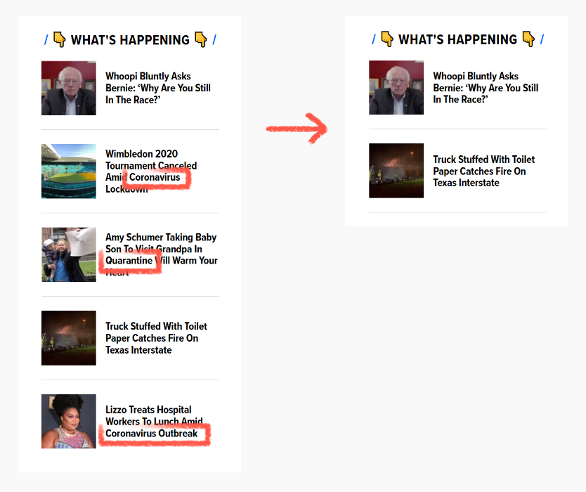

  

# Phagocyte

A very basic browser extension that hides _most_ news articles about the coronavirus.

We all take the current pandemic very seriously and have adapted our lifestyles accordingly. Shouldn't we focus on our physical and mental wellbeing instead of spending a whole afternoon tracking death statistics?

[>>> Click here to download <<<](https://addons.mozilla.org/firefox/addon/phagocyte/)
